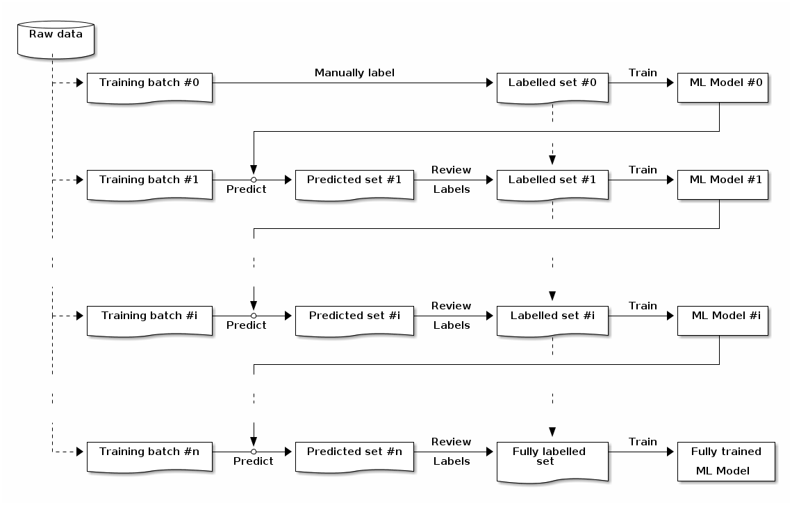

# Label wrapper

User friendly image bootstraping framework.

# Demo
See: 

# Label bootstrapping flow

Label wrapper enables label bootstrapping process:
1. Load first data batch
1. Manually label first batch
1. Train first segmentation model
1. Load second data batch
1. Use first trained segmentation model to predict labels
1. Review labels and merge first and second labelled data
1. train the second segmentation model
1. Repeat steps 4.-7. until out of raw data or review of labels is no longer required.

# Thanks

Label editor used is [VIA 2.0.6](https://gitlab.com/vgg/via/raw/via-2.0.6/via.html).